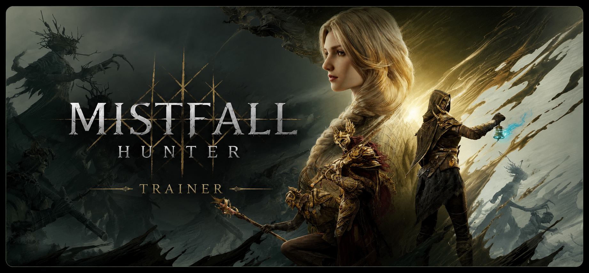

# Mistfall Hunter Trainer

Enhance your single-player experience with a lightweight and easy-to-use trainer for **Mistfall Hunter**.

  <b>⬇ Click the banner below to download the latest version ⬇</b>

    

> **For educational purposes only. Use in offline/single-player modes.**

---

## Features

* Infinite Health
* Infinite Stamina
* Unlimited Dodge
* One Hit Kill
* No Skill Cooldown
* Infinite Skill Charges
* Infinite Consumables
* Unlimited Ammo
* Instant Reload
* Increased Movement Speed
* Super Jump
* No Fall Damage
* Freeze Enemies
* Teleport to Waypoint
* Custom Game Speed
* FOV Changer
* ESP

  * Players
  * Enemies
  * Elite Enemies
  * Loot
  * Chests
  * Quest Objectives
* Item Highlight
* Damage Multiplier
* Defense Multiplier
* Easy Crafting
* Unlimited Currency
* Save Position
* Load Position

---

## Controls

| Key        | Action            |
| ---------- | ----------------- |
| **Insert** | Open / Close Menu |
| **F1**     | Enable Trainer    |
| **Delete** | Hide Overlay      |

---

## Requirements

* Windows 10 / Windows 11 (64-bit)
* Latest game version
* Run the trainer as Administrator

---

## Installation

1. Launch **Mistfall Hunter**.
2. Run the trainer as Administrator.
3. Press **Insert** to open the menu.
4. Enable the features you need.

---

## Notes

* Compatible with the latest available game update.
* Disable antivirus if it falsely detects the trainer.
* Close other overlays if you experience conflicts.

---

## Disclaimer

This project is provided for **educational purposes only**. The trainer is intended for offline/single-player gameplay. Use at your own discretion.
